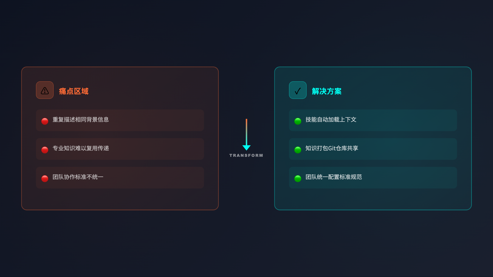

# Claude Code Skills 入门：什么是 Skills，为什么你需要它

> 这是「Claude Code Skills 教程系列」的第 1 篇。本系列将带你从零开始，完整掌握 Claude Code Skills 这一革命性功能。

---

## 一、你是否遇到过这样的场景？

想象这样一个场景：

你正在用 Claude 帮你处理工作。每次开始新对话，你都需要重新输入一大段指令：

```Plaintext
请帮我写代码时遵循以下规范：
1. 使用 TypeScript
2. 函数必须有 JSDoc 注释
3. 变量命名用 camelCase
4. 每个函数不超过 50 行
5. 必须有错误处理
...
```

第二天，你又开始新对话，这段指令又要重新输入一遍。

一周后，你发现：

- **每次对话都要重复输入相同的指令** —— 浪费时间
- **有些复杂的流程很难用几句话说清楚** —— 沟通成本高
- **团队里每个人都各自为战，没有统一标准** —— 难以协作

这时候你可能会想：**能不能让 Claude "记住"这些专业知识，需要的时候自动调用？**

答案是：**能**。这就是 Claude Code Skills 要解决的问题。




---

## 二、什么是 Claude Code Skills？

### 官方定义

先看官方怎么说：

> **Skills are folders of instructions, scripts, and resources that Claude loads dynamically to improve performance on specialized tasks.**

翻译一下：Skills 是包含指令、脚本和资源的文件夹，Claude 可以动态加载它们来提升在特定任务上的表现。

### 通俗理解

用个更形象的比喻：

**传统的提示词** 就像你每次去餐厅都要从头告诉服务员你的口味偏好：

- "我要少盐"
- "我不吃香菜"
- "我喜欢辣一点"
- "我想要温的汤"

**Claude Skills** 就像是餐厅记住了你的偏好档案：

- 第一次你告诉它这些偏好
- 它记录下来，下次自动调用
- 你只需要说"老样子"或"按我的习惯来"

### Skills 的本质

从技术角度看，一个 Skill 最简单的结构只需要：

```Plaintext
my-skill/
└── SKILL.md
```

对，就一个文件夹加一个 Markdown 文件。

`SKILL.md` 里有两部分：

- **元数据**（YAML 格式）：告诉 Claude 这个技能叫什么、什么时候用
- **指令内容**：具体的执行步骤和规范

举个例子，"代码规范"技能的 `SKILL.md` 可能长这样：

```YAML
---
name: typescript-coding-standards
description: 当编写 TypeScript 代码时使用此技能，确保代码符合团队规范
---

# TypeScript 代码规范

## 命名规范
- 变量使用 camelCase
- 类型使用 PascalCase
- 常量使用 UPPER_SNAKE_CASE

## 函数规范
- 每个函数必须有 JSDoc 注释
- 函数不超过 50 行
- 必须有错误处理
...
```

### 与传统方式的核心区别

| 特征 | 传统提示词 | Claude Skills |
|-|-|-|
| **持久化** | 每次对话都要重新输入 | 一次配置，永久使用 |
| **复用性** | 需要复制粘贴或重新输入 | 自动发现并调用 |
| **上下文消耗** | 每次都占用 token | 按需加载，高效利用 |
| **团队协作** | 每人各自维护自己的提示词 | 可以通过 Git 共享 |
| **版本管理** | 难以追踪变化 | 纳入版本控制系统 |

---

## 三、Skills 解决的核心问题

### 问题一：重复劳动的效率陷阱

**场景**：你是一位内容创作者，每次让 Claude 写公众号文章都要输入风格要求：

```Plaintext
写作风格要求：
1. 标题要有吸引力，不超过 20 字
2. 开头用故事或数据引入
3. 正文用小标题分段
4. 语言口语化，避免学术腔
5. 结尾要有互动提问
...
```

**成本计算**：

- 假设这段指令 500 tokens
- 每天启动 5 次新对话
- 一周消耗：500 × 5 × 7 = **17,500 tokens**
- 一年消耗：约 **900,000 tokens**

**Skills 的解决方案**：

- 创建一个"公众号写作"技能
- 第一次配置，之后自动调用
- **一年节省数十万 tokens**

### 问题二：上下文窗口的有限性

**核心矛盾**：

Claude 的上下文窗口是有限的（虽然已经很大，但仍有边界）。

如果你把所有可能的工具、规范、流程都塞进系统提示词：

- 10 个工具 × 每个 100 tokens = 1,000 tokens
- 但你可能只用其中 1-2 个
- **浪费了 80-90% 的上下文空间**

**Skills 的解决方案：渐进式披露**

这是一个非常巧妙的设计：

| 级别 | 内容 | Token 消耗 | 触发条件 |
|-|-|-|-|
| **第一级** | 只加载技能名称和描述 | \~100 tokens | 始终加载 |
| **第二级** | 加载 SKILL.md 主体内容 | \~3,000 tokens | Claude 判定需要时 |
| **第三级** | 按需读取参考文件 | 按实际需要 | 具体使用时 |

**效果对比**：

| 方式 | 初始加载 | 实际使用 | 效率 |
|-|-|-|-|
| 传统方式 | 3,000 tokens | 3,000 tokens | 低 ❌ |
| Skills | 100 tokens | 3,100 tokens | 高 ✅ |

这意味着你可以给 Claude "装备" 更多技能，而初始占用远低于传统方式。

### 问题三：专业知识难以复用

**场景**：你是一位 Python 开发者，熟悉项目的数据库架构：

```Python
# 用户表
User(id, username, email, created_at, last_login)

# 订单表
Order(id, user_id, status, total, created_at)

# 关系：一个用户可以有多个订单
User.orders -> Order[]
```

**传统方式**：

- 每次让 Claude 写相关代码，都要重新解释架构
- Claude 可能会"忘记"之前的细节
- 你需要反复重复相同的信息

**Skills 的解决方案**：

创建一个"数据库架构"技能，把 schema 写进 `references/schema.md`。

之后你只需要说："查询本月新用户的订单数量"

Claude 会：

1. 自动识别需要数据库架构信息
2. 加载对应的技能
3. 读取 schema 文件
4. 生成正确的查询代码

### 问题四：团队知识沉淀难题

**传统协作的痛点**：

```Plaintext
开发者 A：我的代码规范是...
开发者 B：我是这样写的...
开发者 C：我们团队好像没有统一标准...

新成员入职：请问团队的代码规范是什么？
老成员：额...大家大概都差不多，你看看以前的代码吧
```

**Skills 的协作价值**：

```Plaintext
项目仓库/
└── .claude/
    └── skills/
        ├── coding-standards/      # 代码规范（团队共享）
        ├── api-workflow/          # API 开发流程（团队共享）
        └── deployment-guide/      # 部署指南（团队共享）
```

**好处**：

- 知识沉淀在代码仓库中
- 新成员克隆项目即获得所有团队知识
- 规范更新通过 Git 追踪
- 每个人用的都是最新版本

---

## 四、Skills 的核心机制：渐进式披露

### 什么是渐进式披露？

**渐进式披露（Progressive Disclosure）** 是 Claude Skills 最核心的设计创新。

简单来说就是：**不要一次性把所有信息都给出来，而是按需分层次提供。**

### 三级加载机制

#### 第一级：元数据（始终可见）

Claude 启动时，会扫描所有技能的元数据：

```YAML
---
name: prd-generator
description: 将需求整理成规范的产品需求文档
---
```

每个技能只消耗约 **100 tokens**，即使你有 50 个技能，也只占用 5,000 tokens。

#### 第二级：SKILL.md 主体（按需加载）

当 Claude 判定某个技能与当前任务相关时，才会读取完整的 SKILL.md 文件。

比如你说："帮我把会议记录整理成 PRD"

Claude 会：

1. 扫描所有技能描述
2. 识别到 "prd-generator" 的描述匹配
3. 读取完整的 SKILL.md
4. 按照其中的指令执行

#### 第三级：参考资源（具体使用时）

如果 SKILL.md 中引用了其他文件：

```Markdown
## PRD 模板
详见 [PRD_TEMPLATE.md](references/PRD_TEMPLATE.md)
```

只有当 Claude 真正需要用到模板时，才会去读取这个文件。

### 效率对比示例

假设你有以下技能：

- 代码规范（2,000 tokens）
- PRD 生成（1,500 tokens）
- 公众号写作（1,800 tokens）
- 数据库查询（1,200 tokens）
- 部署流程（1,000 tokens）

**传统方式**：

- 初始加载：2,000 + 1,500 + 1,800 + 1,200 + 1,000 = **7,500 tokens**
- 每次对话都占用

**Skills 方式**：

- 初始加载：5 个技能 × 100 tokens = **500 tokens**
- 写代码时：500 + 2,000 = **2,500 tokens**
- 写 PRD 时：500 + 1,500 = **2,000 tokens**

**节省**：50-70% 的初始上下文占用

---

## 五、你能用 Skills 做什么？

### 三个典型应用场景

#### 场景一：代码开发规范

**问题**：团队代码风格不一致，review 成本高

**Skills 解决方案**：

```Plaintext
.claude/skills/coding-standards/
├── SKILL.md
├── references/
│   ├── naming-conventions.md
│   ├── error-handling.md
│   └── testing-guide.md
└── scripts/
    └── lint-check.py
```

**效果**：Claude 写的代码自动符合团队规范

#### 场景二：文档生成自动化

**问题**：每次写 PRD、技术文档都要重复相同格式

**Skills 解决方案**：

```Plaintext
.claude/skills/prd-generator/
├── SKILL.md
├── references/
│   ├── prd-template.md
│   └── requirement-checklist.md
└── examples/
    ├── saas-prd-sample.md
    └── feature-prd-sample.md
```

**效果**：从会议记录到完整 PRD，5 分钟搞定

#### 场景三：内容创作辅助

**问题**：多平台发布，每个平台风格不同

**Skills 解决方案**：

```Plaintext
.claude/skills/
├── wechat-article-writer/
│   └── SKILL.md  # 公众号风格规范
├── xiaohongshu-writer/
│   └── SKILL.md  # 小红书风格规范
└── twitter-writer/
    └── SKILL.md  # Twitter 风格规范
```

**效果**：一份内容，自动适配多个平台

### 官方技能库

Anthropic 在 GitHub 上开源了官方技能仓库，包含 16+ 个实用技能：

**文档处理类**：

- `docx` - 处理 Word 文档
- `pdf` - 处理 PDF 文件
- `pptx` - 生成 PowerPoint
- `xlsx` - 处理 Excel 表格

**开发辅助类**：

- `testing-web-apps` - Web 应用测试
- `mcp-server-generator` - MCP 服务器生成

**创意设计类**：

- `ascii-art` - ASCII 艺术生成
- `music` - 音乐创作辅助

安装命令：

```Bash
/plugin marketplace add anthropics/skills
```

### 个人与团队的价值

| 维度 | 个人价值 | 团队价值 |
|-|-|-|
| **效率** | 减少重复输入，加快工作速度 | 统一标准，降低沟通成本 |
| **质量** | 保持输出一致性 | 确保团队成果质量稳定 |
| **学习** | 沉淀个人知识体系 | 新人快速上手，知识传承 |
| **创新** | 聚焦创意，而非重复劳动 | 聚焦业务，而非基础规范 |

---

## 六、为什么现在要学习 Skills？

### 时代背景

2025-2026 年，AI 助手正在从"通用工具"向"专业助手"转变：

- **第一阶段**：通用大模型（ChatGPT、Claude 3）
- **第二阶段**：Agent 化（能执行复杂任务）
- **第三阶段**：专业化（通过 Skills 具备领域知识）

**Skills 是专业化阶段的关键技术**。

### 竞争优势

对于个人：

- **现在学习**：抢占先机，建立个人知识库
- **一年后**：可能已成为标配技能

对于团队：

- **现在采用**：提升团队效率，形成知识沉淀
- **一年后**：竞争对手可能已经追上

### 学习成本

**好消息**：Skills 的学习门槛很低

- **技术要求**：只需要会写 Markdown
- **时间投入**：2-3 小时掌握基础，一天内上手实践
- **边际收益**：一次投入，长期受益

---

## 七、总结与下一步

### 核心要点回顾

1. **Claude Skills 是什么**：

   - 模块化的知识包
   - 可以被 Claude 动态加载和调用
   - 最简结构只需一个 SKILL.md 文件
2. **Skills 解决什么问题**：

   - 消除重复输入指令的低效
   - 优化上下文窗口的利用
   - 实现专业知识的复用
   - 促进团队知识的沉淀
3. **Skills 的核心机制**：

   - 渐进式披露（Progressive Disclosure）
   - 三级加载：元数据 → SKILL.md → 参考资源
   - 相比传统方式节省 50-70% 初始上下文
4. **Skills 的应用价值**：

   - 个人：效率提升、质量稳定、知识沉淀
   - 团队：标准统一、协作顺畅、降低门槛

### 系列文章预告

这是本系列的第 1 篇，接下来的文章将深入探讨：

- **第 2 篇**：《5 分钟上手 Claude Skills：从零到第一个技能》

  - 手把手教你创建第一个技能
  - 实战演练，边学边做
- **第 3 篇**：《Skills vs 斜杠命令 vs MCP：你应该用哪个？》

  - 三种机制的深度对比
  - 选择决策树
- **第 4 篇**：《渐进式披露：Claude Skills 的核心秘密》

  - 技术原理深度剖析
  - Token 效率优化的艺术
- **第 5-10 篇**：高级技巧、实战案例、生态解析...

### 下一步行动

如果你对 Claude Skills 感兴趣，建议：

1. **订阅本系列**：不错过后续文章
2. **安装 Claude Code**：如果还没有的话
3. **访问官方仓库**：https://github.com/anthropics/skills
4. **准备好你的第一个技能想法**：下篇文章我们将亲手实现它

---

**下一篇文章预告**：  
《5 分钟上手 Claude Skills：从零到第一个技能》

我们将手把手创建一个实用技能，让你亲身体验 Skills 的威力。敬请期待！

---

> 本文是「Claude Code Skills 教程系列」的第 1 篇。  
> 系列目录：查看完整目录  
> 素材库：Claude-Code-Skills教程素材库.md

> 有问题或建议？欢迎在评论区留言，或在公众号后台与我交流。
